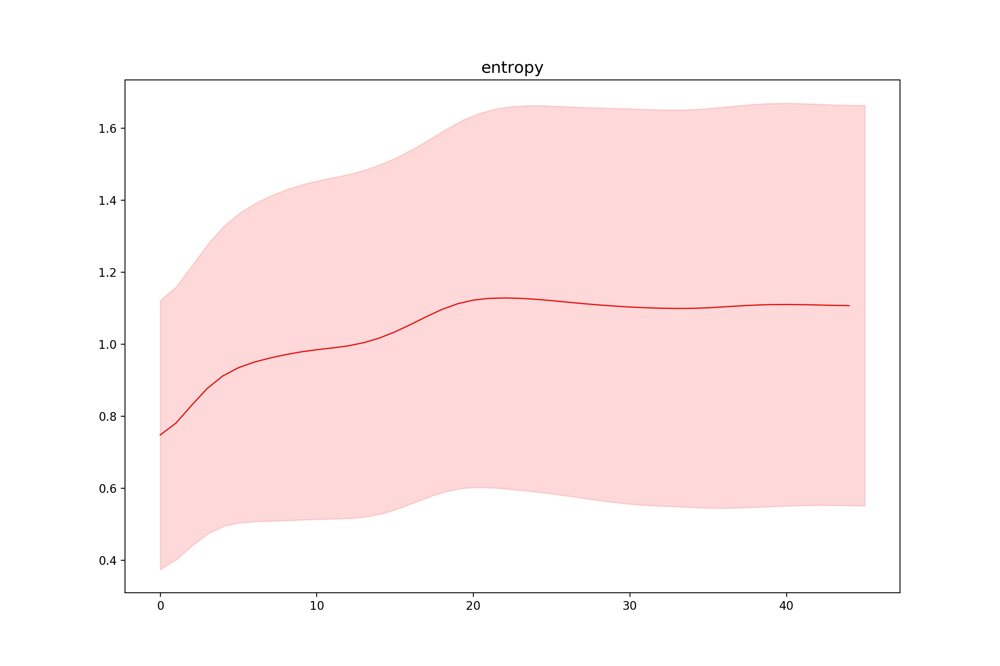
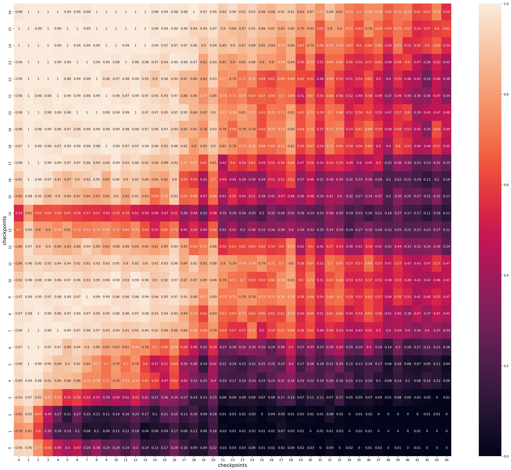

# AlphaZeroSC2

>The first time, I want to try this by using the pySC2, but it is hard to create a zero-sum game in mini-game buildmarines. So I have to restructure the whole game by myself, you can see the details in bmgame.py.

>The mini-game buildmarines in order to solve an optimization problem of the production, but it only has one player. If I set another player in the game, and set some limit of the parameters, it can be transferred to a zero-sum game environment. And I can try to use MCTS to solve this problem.

## 5.21

🙄🙄🙄

**Say Goodbye to the pySC2** (PS: it wastes too much of my time, nearly a month)

😚😚😚

**Say Hello to my bmgame** (PS: I try my best to restructrue the whole game logic, also about the inner parameters)

Maybe I need to explain why I want to do this. First, I like the SC2 game😋. Second, it's my course work 😥(solve a zero-sum game by using MCTS).

## 5.22

It's easy for me to restart at any obs/node as I want. I set the env(bmgame) to be out of the agent unlike it was before. The obs which the env return combines everything about the current state of the env. So you can easily copy obs if you want to store it in the child node.

* The dqn_model and dqn_agent are completed!
* The MCTS is over a half.

## 5.23

😘😘😘

I have finished the obvious bugs, and now, training can be started.
I test some epoch, the simulation results most likely the draw. The agent doesn't know how to build marines in current policy. 

* For the setting default, simulation of a whole game cost about 3mins.

Maybe, parallel training set is difficult for me now. I will try if I have a time. I need to finish the report first.

The training log just like below, the **simulation result[-2]** means the reward. So "[0,0]" means draw. The total steps of the game are 500. Every search in the one step of simulation about 200 times. The time cost of a whole game can be seen in line **simulation i cost xxx second**.

~~~bash
simulation start : 2/500
simulation result :  [[2650.0, 1.25, 4350.0], [135, 12, 12, 0], [10, 1], [[], [], [], []], [2800.0, 1.25, 4350.0], [135, 12, 12, 0], [10, 0], [[], [], [], []], [0, 0], [250, 250]]
simulation 2 cost 116.15 second
simulation is over!
start training!
epoch 0 batchloss:  0.013598231598734856
epoch 1 batchloss:  0.0140206478536129
epoch 2 batchloss:  0.015985790640115738
epoch 3 batchloss:  0.01822245679795742
epoch 4 batchloss:  0.011359521187841892
simulation start : 3/500
simulation result :  [[4182.0, 1.2, 5982.0], [123, 19, 19, 0], [9, 0], [[], [], [], []], [3572.0, 1.25, 5422.0], [147, 20, 16, 0], [11, 0], [[], [], [], []], [0, 0], [250, 250]]
simulation 3 cost 107.9 second
simulation is over!
start training!
epoch 0 batchloss:  0.008436528965830803
epoch 1 batchloss:  0.007282668724656105
epoch 2 batchloss:  0.007358501199632883
epoch 3 batchloss:  0.007472369819879532
epoch 4 batchloss:  0.006356597878038883
~~~

## 5.24

There is a trouble in the training now! The agent seems to fall into local optimality. As shown in the log, at first, it doesn't know how to build the depot, so the population of SCV is stuck at 15. Then, it start to build the depot for increasing total population, in order to build more SCV to accelerate the collecting of mainral. But it is far from the goal of building marines.

### test
* The reward is no longer divided by the trajectory step.
* Increase the warm-up phase.
* Change the Loss design, it means to use other algorithem no longer DQN.
* Change the default game parameters: 
    * total steps 500 -> 600
    * mineral rate function
* VS random opponent agent
* Add noise to the action prob from the model predict result
* Add intrinsic reward                                          

## 5.25

I made a big mistake, when the agent generated data, it needed a randomicity, for example, random.choice from action prob , or add a noise to th action prob and sample the maxprob. If don't do this, the model will be stable and the choice in each step will be fixed. So you will see the same result of the game simulation.

Another question is that I'm not clear how to keep the policy optimized monotonously.

**A simple parallelization method I implemented is through the Pipe function. It doesn't accelerate the rate of simulation but can get more trans data from parallelized simulation in one time.** 

## 5.26

I have encountered something strange, my multi-threaded simulation results are exactly the same, whether I set a global random seed or an in-thread random seed, the results of both threads are always the same, and the results of multiple iterations are also the same, I am currently still not figuring out what the reason is, I plan to rewrite the parallelization code.

~~~bash
Running on cpu and 2 processes
simulation start : 1/500
parent process: 790
process id: 947
new obs getting
get trans from 0 process
parent process: 790
process id: 948
new obs getting
simulation result : [[32.0, 30.0, 7732.0], [159, 104, 63, 27], [12, 7], [[6, 11, 14], [2, 3, 4, 6, 7, 10, 16, 20, 23, 24, 25], [], [32, 47]], [87.5, 30.0, 7287.5], [111, 111, 65, 37], [8, 5], [[2, 5, 7], [3, 6, 11, 14, 17, 22], [], [59]], [27, 37], [289, 288]] 

get trans from 1 process
simulation result : [[32.0, 30.0, 7732.0], [159, 104, 63, 27], [12, 7], [[6, 11, 14], [2, 3, 4, 6, 7, 10, 16, 20, 23, 24, 25], [], [32, 47]], [87.5, 30.0, 7287.5], [111, 111, 65, 37], [8, 5], [[2, 5, 7], [3, 6, 11, 14, 17, 22], [], [59]], [27, 37], [289, 288]] 

stop process
simulation 1 cost 105.25 second
simulation is over!
simulation start : 2/500
parent process: 790
process id: 1121
new obs getting
get trans from 0 process
parent process: 790
process id: 1122
new obs getting
simulation result : [[32.0, 30.0, 7732.0], [159, 104, 63, 27], [12, 7], [[6, 11, 14], [2, 3, 4, 6, 7, 10, 16, 20, 23, 24, 25], [], [32, 47]], [87.5, 30.0, 7287.5], [111, 111, 65, 37], [8, 5], [[2, 5, 7], [3, 6, 11, 14, 17, 22], [], [59]], [27, 37], [289, 288]] 

get trans from 1 process
simulation result : [[32.0, 30.0, 7732.0], [159, 104, 63, 27], [12, 7], [[6, 11, 14], [2, 3, 4, 6, 7, 10, 16, 20, 23, 24, 25], [], [32, 47]], [87.5, 30.0, 7287.5], [111, 111, 65, 37], [8, 5], [[2, 5, 7], [3, 6, 11, 14, 17, 22], [], [59]], [27, 37], [289, 288]] 

stop process
simulation 2 cost 105.11 second
simulation is over!
~~~

## 5.28

🏆🏆🏆
**Congradulation myself, I have finished the multiprocesses evaluating program.**

* The "top" reflect the CPU used information as follow:

* evaluating 45 checkpoints needs 1735 seconds
* The evaluting results as follow:

Where the number in the axis means the iterations of checkpoint. And the number in the box means win rate. The performance getting better.

👊👊👊  
**Tonight belongs to UEFA Champions League**  
**Tomorrow belongs to LOL MSI**

## 5.29

The parallel training setting can only run in debug mode. I haven't overcome this bug, it seems a little difficult.

## 5.31

When evaluating the checkpoints, the entropy of the action probability distribution as follow:

As the training progresses, the entropy of the action probability distribution output by the policy gradually increases, and the mean and variance tend to be stable when approaching the convergence.

## 6.11

🤾‍♂️🤾‍♂️🤾‍♂️
Congrats to the GW, Curry is the big man.

After all kinds of hardships, the multi-process trial version finally succeeded, you can see the detials in the branch "multi". It also contains some algorithmic improvements.

~~~bash
simulation start : 1/500 
rank 10 simulation 1 cost 50.19 second 
simulation result : [[518.0, 28.0, 7668.0], [147, 116, 50, 53], [11, 1], [[], [1, 3, 5, 6, 8, 10, 11, 15, 18, 20, 22, 23, 25], [], [59]], [49.5, 30.0, 7349.5], [123, 111, 61, 38], [9, 5], [[17], [1, 5, 8, 9, 10, 16, 17, 18, 20, 22, 23], [], [48]], [53, 38], [288, 288]] 
rank 8 simulation 1 cost 50.9 second 
simulation result : [[166.0, 27.0, 7666.0], [147, 120, 44, 65], [11, 3], [[], [3, 7, 9, 14, 15, 16, 18, 20, 22, 24, 25], [], []], [53.0, 29.0, 7353.0], [123, 111, 58, 41], [9, 6], [[9], [2, 8, 10, 14, 15, 16, 18, 22, 23, 24, 25], [], []], [65, 41], [293, 293]] 
rank 3 simulation 1 cost 51.85 second 
simulation result : [[2600.0, 29.0, 7750.0], [147, 76, 56, 1], [11, 2], [[], [2, 3, 4, 5, 7, 8, 9, 12, 13, 14, 15, 16, 17, 20, 21, 22, 23, 24, 25], [], []], [112.75, 30.0, 7262.75], [123, 108, 60, 36], [9, 6], [[11, 17], [3, 6, 8, 9, 11, 12, 14, 16, 20, 21], [], []], [1, 36], [288, 287]] 
rank 4 simulation 1 cost 52.31 second 
simulation result : [[74.0, 28.0, 7724.0], [147, 120, 47, 59], [11, 4], [[15], [1, 2, 6, 7, 8, 10, 11, 13, 15, 17, 19, 22, 24], [], []], [50.0, 29.0, 7300.0], [123, 107, 58, 35], [9, 7], [[13], [1, 2, 4, 8, 10, 11, 13, 15, 16, 18, 20, 23, 25], [], []], [59, 35], [291, 290]] 
rank 7 simulation 1 cost 54.88 second 
simulation result : [[68.0, 26.0, 7518.0], [171, 118, 36, 67], [13, 2], [[16], [1, 2, 5, 8, 9, 11, 13, 14, 16, 17, 18, 19, 21, 22], [], []], [239.75, 29.0, 7489.75], [99, 99, 58, 41], [7, 4], [[], [], [], [23, 27, 37, 46, 48, 49, 53]], [67, 41], [295, 295]] 
rank 2 simulation 1 cost 55.52 second 
simulation result : [[28.0, 26.0, 7528.0], [159, 118, 37, 66], [12, 3], [[], [1, 3, 4, 7, 9, 11, 12, 13, 16, 18, 19, 21, 22, 23, 25], [], []], [277.5, 29.0, 7477.5], [111, 111, 56, 47], [8, 5], [[2, 5, 9], [1, 8, 9, 12, 16], [], [32]], [66, 47], [294, 293]] 
rank 9 simulation 1 cost 57.16 second 
simulation result : [[1059.0, 28.0, 7609.0], [159, 102, 48, 41], [12, 2], [[], [2, 3, 4, 5, 9, 12, 13, 14, 15, 20, 22, 23, 24], [], []], [48.5, 29.0, 7398.5], [111, 111, 58, 44], [8, 5], [[6], [1, 2, 4, 6, 8, 9, 11, 16], [], [55, 60]], [41, 44], [290, 290]] 
rank 5 simulation 1 cost 57.71 second 
simulation result : [[84.0, 27.0, 7684.0], [147, 122, 45, 67], [11, 2], [[], [1, 3, 5, 8, 9, 10, 15, 17, 19, 24], [], [58]], [118.75, 29.0, 7318.75], [123, 106, 52, 41], [9, 7], [[4, 5, 9, 10], [1, 3, 6, 7, 14, 16, 19, 21, 22], [], []], [67, 41], [294, 293]] 
rank 1 simulation 1 cost 58.2 second 
simulation result : [[119.0, 28.0, 7669.0], [159, 122, 50, 56], [12, 2], [[], [1, 2, 3, 4, 5, 6, 7, 8, 10, 12, 16, 17, 18, 21, 22, 24], [], []], [98.75, 30.0, 7348.75], [111, 109, 61, 34], [8, 7], [[9], [2, 3, 5, 6, 8, 10, 12, 13, 15, 18, 21, 22, 23], [], []], [56, 34], [290, 290]] 
rank 6 simulation 1 cost 58.98 second 
simulation result : [[357.0, 27.0, 7607.0], [159, 116, 44, 57], [12, 1], [[14, 16], [2, 4, 6, 8, 10, 11, 13, 14, 15, 17, 20, 21, 25], [], [58]], [52.5, 29.0, 7402.5], [111, 111, 59, 38], [8, 6], [[4, 10, 14, 17], [3, 5, 6, 8, 11, 13, 14, 16, 21, 23], [], [27]], [57, 38], [292, 291]] 
start training! 
epoch 0 batchloss: (3.211031436920166, 1.65144944190979, 1.5595818758010864) 
epoch 1 batchloss: (2.581749200820923, 1.2176967859268188, 1.364052414894104) 
epoch 2 batchloss: (2.4575068950653076, 1.1275615692138672, 1.3299453258514404) 
epoch 3 batchloss: (2.1349072456359863, 0.8752843737602234, 1.2596228122711182) 
epoch 4 batchloss: (2.201287031173706, 0.9719098806381226, 1.2293771505355835) 
~~~

## 6.14

It is worth noting that compared with single-process training, multi-process training will exacerbate the instability in the training process. Batch size, learning rate, gradient clipping, optimal model estimation all need to be more careful.

Here, a comparision between the training checkpoints of single and multi can express my point of view more clearly.

The ordinate represents the checkpoints of the multi-training, and it is obvious that the updates of the 13th and 14th checkpoints are not stable.

Compared with a single process, multi-process training accelerates the performance of the model significantly. It is necessary to solve large-scale problems.

## TODO
* ~~reset MCTS in new game environment~~
* ~~train set in new game environment~~
* ~~maybe the parallel training set~~

## Others

In general, setting up such a perfect information dynamic zero-sum game is solvable, and its bottleneck is usually computing power. But in fact, the game can be set up to be a little more challenging, such as a static zero-sum game with imperfect information. That is, at each moment, both players make decisions at the same time, instead of taking turns to make decisions.